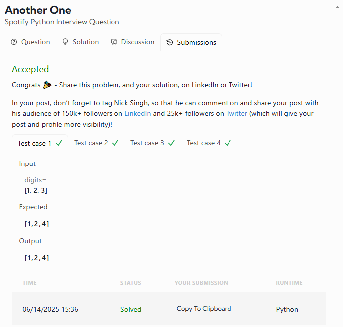
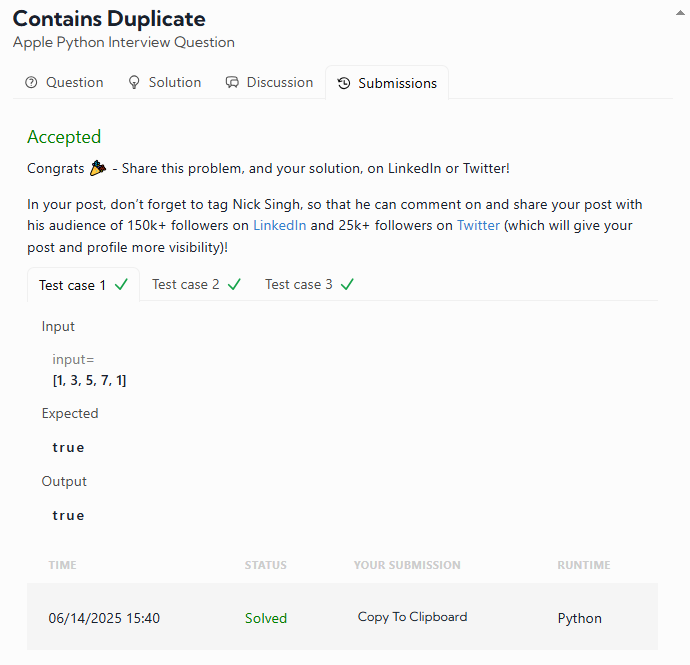
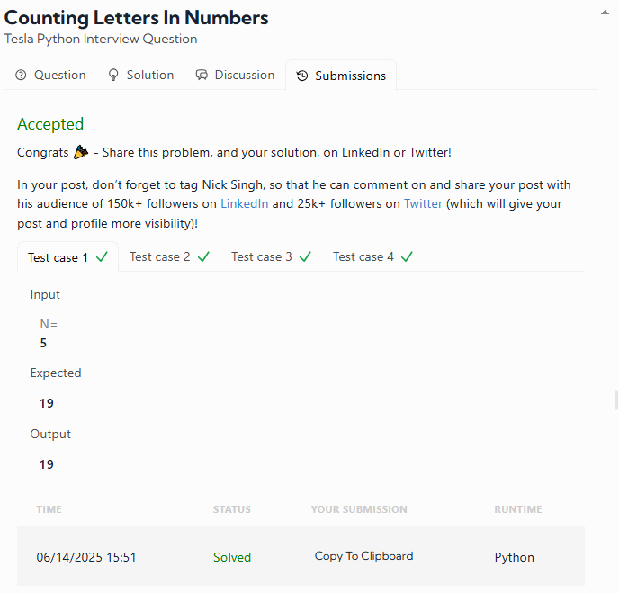

# DATALEMUR - Python Exercises

# 1- Another One - Spotify Python Interview Question

🎶 **Spotify Python Interview Question**  

This simple project creates a digital clone of DJ Khaled's famous "Another One" catchphrase by adding 1 to a number represented as an array of digits.

## How It Works

Given an array of digits representing a number (most significant digit first), the function returns a new array representing that number plus one.

### Examples:
- Input: `[1, 2, 3]` → Output: `[1, 2, 4]` (123 + 1 = 124)
- Input: `[6, 9]` → Output: `[7, 0]` (69 + 1 = 70)
- Input: `[9, 9]` → Output: `[1, 0, 0]` (99 + 1 = 100)

```python
def plus_one(digits):
    n = len(digits)
    
    for i in range(n - 1, -1, -1):
        if digits[i] < 9:
            digits[i] += 1
            return digits  # done, no carry needed
        digits[i] = 0  # carry over to next digit

    # if loop completes, all digits were 9
    return [1] + digits
```

### My result was:



# 2- Contains Duplicate Checker  

🍏 **Apple Python Interview Question**  

This Python function checks if a given list of integers contains any duplicate values.  

## 📌 Problem Statement  
Given a list of integers `input`, return:  
- `True` if any value appears at least twice in the list.  
- `False` if all elements are distinct.  

### Examples:  
- `[1, 3, 5, 7, 1]` → Returns `True` (because `1` is duplicated)  
- `[1, 3, 5, 7]` → Returns `False` (all elements are unique)  

## 🛠 Implementation  
The solution efficiently checks for duplicates using a **set** for O(1) lookups, resulting in an overall **O(n)** time complexity.  

## 🚀 How to Use  
1. Pass a list of integers to the function.  
2. It returns `True` if duplicates exist, `False` otherwise.  

```python
def contains_duplicate(input):
    return len(input) != len(set(input))
```  

### My result was:



# 3- Counting Letters In Numbers

🚗 **Tesla Python Interview Question**

## Description
Given an integer `N`, write out all numbers from `1` to `N` (inclusive) in English words and count the total number of letters used, excluding spaces and hyphens. Follow British English conventions, including the use of "and" for numbers over 100 (e.g., "one hundred and fifteen").

## Rules
1. **No spaces or hyphens** are counted.
2. **British usage** applies:
   - Include "and" for numbers > 100 (e.g., `115` → "one hundred and fifteen").
3. **Input constraint**: `1 ≤ N ≤ 1000`.

## Examples

### Example 1
**Input:**  
```python
N = 5
```  
**Output:**  
```python
19
```  
**Explanation:**  
Numbers from `1` to `5` in words:  
- `1` → "one" (3 letters)  
- `2` → "two" (3 letters)  
- `3` → "three" (5 letters)  
- `4` → "four" (4 letters)  
- `5` → "five" (4 letters)  
**Total letters:** `3 + 3 + 5 + 4 + 4 = 19`.

```python
def number_to_words(n):
    ones = ["", "one", "two", "three", "four", "five", "six", "seven", "eight", "nine"]
    teens = ["ten", "eleven", "twelve", "thirteen", "fourteen", "fifteen",
             "sixteen", "seventeen", "eighteen", "nineteen"]
    tens = ["", "", "twenty", "thirty", "forty", "fifty",
            "sixty", "seventy", "eighty", "ninety"]

    if n == 1000:
        return "one thousand"
    elif n >= 100:
        rem = n % 100
        hundreds = ones[n // 100] + " hundred"
        if rem == 0:
            return hundreds
        else:
            return hundreds + " and " + number_to_words(rem)
    elif n >= 20:
        return tens[n // 10] + ("-" + ones[n % 10] if n % 10 != 0 else "")
    elif n >= 10:
        return teens[n - 10]
    else:
        return ones[n]

def count_letters_up_to_n(n):
    total = 0
    for i in range(1, n + 1):
        words = number_to_words(i)
        letters = words.replace(" ", "").replace("-", "")
        total += len(letters)
    return total
```

### My result was:
