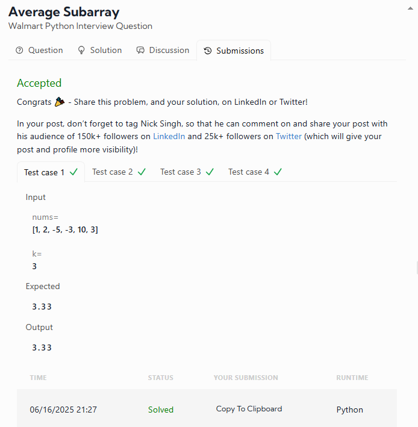

# DATALEMUR - Python Exercises

# 1- Average Subarray

**Walmart Python Interview Question**

This repository contains the solution to a common interview question asked by companies like Walmart: finding the **maximum average value** of a contiguous subarray of fixed length `k`.

## 🧩 Problem Description

Given:

* An integer array `nums` consisting of `n` elements.
* An integer `k`.

Your task is to find the **contiguous subarray** of length `k` that has the **highest average value** and return this value **rounded to two decimal places**.

A subarray is a consecutive portion of the original array.

### 🔍 Examples

#### Example 1

```python
Input: nums = [1, 2, -5, -3, 10, 3], k = 3
Output: 3.33
```

**Explanation:** The subarray `[-3, 10, 3]` has the highest average: (−3 + 10 + 3) / 3 = 3.33

#### Example 2

```python
Input: nums = [9], k = 1
Output: 9.00
```

**Explanation:** Only one element, so the average is 9.00.

### My result was:


# 2- Coin Change

**Amazon Python Interview Question**

This repository contains a solution to the classic **Coin Change** problem, commonly asked in technical interviews at companies like Amazon. The objective is to determine the **minimum number of coins** needed to make up a given target amount using an unlimited supply of given coin denominations.

## 🧩 Problem Description

You are given:

* An integer array `coins` representing different denominations of coins.
* An integer `target_amount` representing the total amount of money you need to make.

Your task is to return the **fewest number of coins** needed to make up the target amount.
If it's not possible to form that amount using any combination of the coins, return `-1`.

You may **use each coin an unlimited number of times**.

### 🔍 Examples

#### Example 1

```python
Input: coins = [2, 4, 1, 4], target_amount = 5
Output: 2
```

**Explanation:**
One optimal combination is `[4, 1]`, which uses only **2 coins**.

#### Example 2

```python
Input: coins = [2], target_amount = 3
Output: -1
```

**Explanation:**
It's impossible to form 3 using only 2s, so the result is **-1**.


### My result was:


# 3- Hill Climbing

**Swiggy Python Interview Question**

This isn't about AI or optimization — it's about **literally** climbing a hill. Swiggy wants to know if you can navigate steep steps as efficiently as you do complex code.

You're standing at the base of a hill with `n` steps carved into it. You can climb the hill by taking either **1 step** or **2 steps** at a time. Your mission is to figure out how many **distinct ways** you can reach the top.

## 🧩 Problem Description

Given an integer `n`, representing the number of steps on the hill, return the number of **distinct ways** to climb to the top using steps of size 1 or 2.

### 🔍 Examples

#### Example 1

```python
Input: 3
Output: 3
```

**Explanation:**

* 1 + 1 + 1
* 1 + 2
* 2 + 1

#### Example 2

```python
Input: 4
Output: 5
```

**Explanation:**

* 1 + 1 + 1 + 1
* 1 + 1 + 2
* 1 + 2 + 1
* 2 + 1 + 1
* 2 + 2


### My result was:
