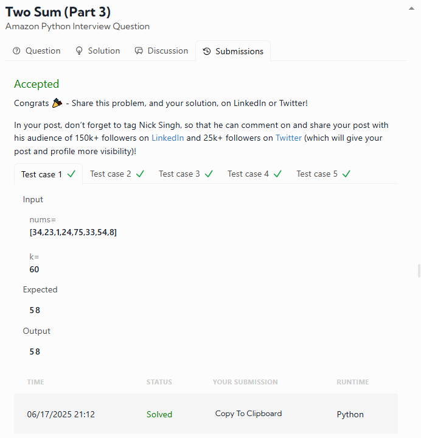

# DATALEMUR - Python Exercises

# 1- Two Sum

**Amazon Python Interview Question**

One of the most popular and foundational problems in technical interviews, the **Two Sum** problem tests your ability to efficiently search, manage indices, and handle edge cases.

Your task is to return the **indices of two numbers** from a list that add up to a given target. But be careful — you **can’t use the same element twice**, and the **indices must be returned in increasing order**.

## 🧩 Problem Description

Given:

* A list of integers `nums`
* An integer `target`

Return the **indices** of the two elements that sum up to `target`.

### 🔎 Clarifications

* Each input will have **at most one solution**
* If there is **no valid solution**, return `[-1, -1]`
* You **cannot use the same element twice**
* Return indices in **increasing order**, e.g., `[1, 3]`, not `[3, 1]`

---

## 🔍 Examples

### Example 1

```python
Input: nums = [1, 4, 6, 10], target = 10
Output: [1, 2]
```

**Explanation:** 4 + 6 = 10 → indices \[1, 2]

### Example 2

```python
Input: nums = [1, 4, 6, 10], target = 11
Output: [0, 3]
```

**Explanation:** 1 + 10 = 11 → indices \[0, 3]

### Example 3

```python
Input: nums = [1, 4, 6, 10], target = 2
Output: [-1, -1]
```

**Explanation:** No two elements sum up to 2

### My Result was:


# 2- Two Sum (Part 2)

**Amazon Python Interview Question**

In this variation of the classic **Two Sum** problem, the input array is **sorted in non-decreasing order**, and your solution must be memory-efficient: **no hash maps allowed**. Think **binary search** and **two pointers**.

---

## 🧩 Problem Description

You're given:

* A sorted array `nums` of integers (non-decreasing order)
* An integer `target`

Return the **indices of the two elements** that sum up to `target`.

### ⚠️ Clarifications

* There is **at most one solution**
* Return `[-1, -1]` if no such pair exists
* Do **not** use the same element twice
* Return indices in **increasing order**, e.g., `[2, 5]`, not `[5, 2]`
* Your solution **must use constant extra space**

---

## 🔍 Example

### Example 1

```python
Input: nums = [1, 3, 4, 5, 7, 12, 15], target = 9
Output: [2, 3]
```

**Explanation:**
4 (at index 2) + 5 (at index 3) = 9

### My Result was:


# 3- Two Sum (Part 3)

**Amazon Python Interview Question**

This variation of the **Two Sum** problem asks you to do more than just match a target — you need to find the **largest possible sum of two distinct elements** that is **strictly less than** a given number `k`.

This version tests your ability to **maximize within constraints** — a common requirement in system design and optimization interviews.

---

## 🧩 Problem Description

Given:

* An array of integers `nums`
* An integer `k`

Return the **largest possible sum** of two different elements `nums[i] + nums[j]` such that:

* `i ≠ j`
* `nums[i] + nums[j] < k`

If **no such pair exists**, return `-1`.

---

## 🔍 Example

### Example 1

```python
Input: nums = [34, 23, 1, 24, 75, 33, 54, 8], k = 60
Output: 58
```

**Explanation:**
The pair (34 + 24) = 58 is the closest you can get to 60 without going over.


### My Result was:
