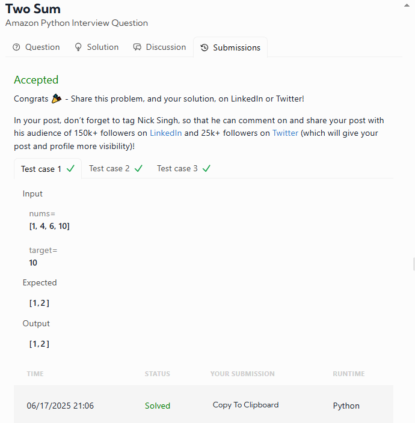

# DATALEMUR - Python Exercises

# 1- Base 13 Conversion

**Capital One Python Interview Question**

You may not use **base 13** every day (or… ever), but understanding non-decimal numeral systems is an essential skill for software engineers and data scientists alike.

In this challenge, you're asked to **convert an integer into its base 13 representation** — and yes, that includes using **letters for digits** beyond 9.

---

## 🧩 Problem Description

Given an **integer `num`**, return its **string representation** in **base 13**.

### 🔢 Base 13 Digits

* 0–9 → as-is
* 10 → `'A'`
* 11 → `'B'`
* 12 → `'C'`

This is similar to hexadecimal, but stops at 13 instead of 16.

---

## 🔍 Examples

| Decimal | Base 13 |                    |
| ------- | ------- | ------------------ |
| 9       | `"9"`   |                    |
| 10      | `"A"`   |                    |
| 11      | `"B"`   |                    |
| 12      | `"C"`   |                    |
| 13      | `"10"`  |                    |
| 14      | `"11"`  |                    |
| 49      | `"3A"`  | *(3×13 + 10 = 49)* |
| 69      | `"54"`  | *(5×13 + 4 = 69)*  |

### My Result was:

