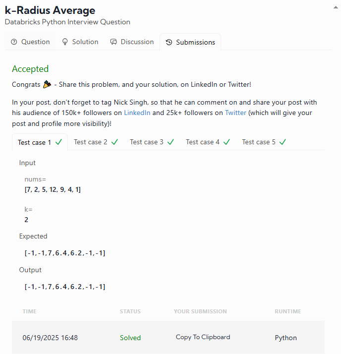

# DATALEMUR - Python Exercises

# 1- k-Radius Average

**Databricks Python Interview Question**

Welcome to the next level of array processing! Building on the "Average Subarray" warmup problem, this challenge is about computing a **k-radius average** for each element in an array — perfect for testing your understanding of **sliding windows**, **efficient traversal**, and **edge handling**.

---

## 🧩 Problem Description

You're given:

* An array of integers `nums` of length `n`
* An integer `k`

The **k-radius average** for an element at index `i` is the average of elements in the subarray from `i - k` to `i + k` (inclusive).

If there are **not enough elements** before or after index `i` to form a valid radius, set `averages[i] = -1`.

### ✅ Output

Return an array `averages` of the same length as `nums`, where:

* Each element is the **rounded average (to 2 decimal places)** if computable
* Otherwise, it's `-1`

---

## 🔍 Example

### Input

```python
nums = [7, 2, 5, 12, 9, 4, 1]
k = 2
```

### Output

```python
[-1, -1, 7.0, 6.4, 6.2, -1, -1]
```

### Explanation

* For `i = 0, 1, 5, 6` → not enough surrounding elements ⇒ `-1`
* For `i = 2` → average of `nums[0]` to `nums[4]` → `(7+2+5+12+9)/5 = 7.0`
* For `i = 3` → `(2+5+12+9+4)/5 = 6.4`
* For `i = 4` → `(5+12+9+4+1)/5 = 6.2`


### My Result was:

