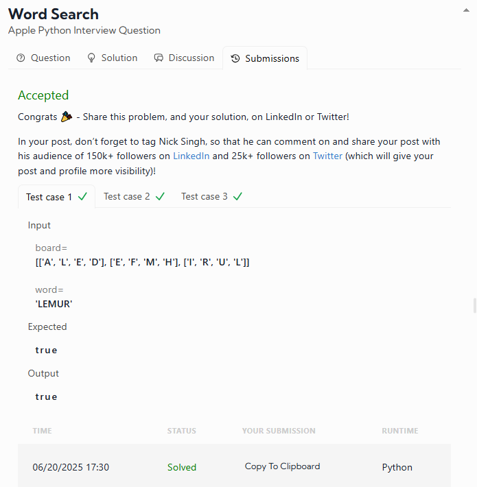

# DATALEMUR - Python Exercises

# 1- Word Search

**Apple Python Interview Question**

This classic problem blends **depth-first search (DFS)** with **grid traversal**, testing your ability to manage recursion, constraints, and backtracking — essential skills for building complex search algorithms and real-time apps.

---

## 🧩 Problem Description

You are given:

* A 2D grid of characters `board` (size `m x n`)
* A string `word`

### Your task:

Return `True` **if and only if** the word exists in the grid.

---

### ✅ Rules

* Each letter in the word must be constructed from adjacent cells (up, down, left, right).
* **Diagonal moves are not allowed.**
* **You cannot use the same cell more than once** in the word.

---

## 🔍 Examples

### Example 1 — ✅ **"LEMUR"**

```python
Input:
board = [['A', 'L', 'E', 'D'],
         ['E', 'F', 'M', 'H'],
         ['I', 'R', 'U', 'L']]
word = "LEMUR"

Output: True
```

---

### Example 2 — ❌ **"PETER"**

```python
Input:
board = [['A', 'B', 'C', 'D'],
         ['P', 'E', 'T', 'H'],
         ['I', 'R', 'K', 'L']]
word = "PETER"

Output: False
```

**Explanation:** The "E" cannot be reused in multiple steps.

---

### Example 3 — ❌ **"FEMUR"**

```python
Input:
board = [['F', 'B', 'C', 'D'],
         ['E', 'M', 'G', 'H'],
         ['I', 'J', 'U', 'R']]
word = "FEMUR"

Output: False
```

**Explanation:** Diagonal movement from "M" to "U" is not allowed.

### My Result was:

