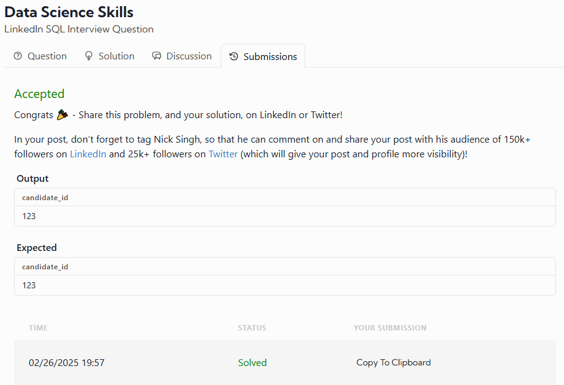

# Candidate Selection for Data Science Job

## Problem Statement
Given a table of candidates and their skills, you need to find the candidates best suited for an open Data Science job. The ideal candidates must be proficient in **Python, Tableau, and PostgreSQL**.

Write a query to list the candidates who possess all of the required skills for the job. The output should be sorted by `candidate_id` in **ascending order**.

## Assumption
- There are no duplicate records in the `candidates` table.

## Table Schema
### `candidates` Table:
| Column Name   | Type    |
|--------------|---------|
| candidate_id | integer |
| skill        | varchar |

## Example Input
### `candidates` Table:
| candidate_id | skill      |
|--------------|-----------|
| 123          | Python    |
| 123          | Tableau   |
| 123          | PostgreSQL|
| 234          | R         |
| 234          | PowerBI   |
| 234          | SQL Server|
| 345          | Python    |
| 345          | Tableau   |

## Example Output
| candidate_id |
|--------------|
| 123          |

## My solution was very simple

SELECT candidate_id from candidates where skill in('Python','Tableau','PostgreSQL') order by candidate_id LIMIT 1;

### Why I used this, based on the last days I saw the fuctions IN, LIMIT and ORDER BY. And the fuctions are very simple. I'm gonna explain this, 

### The fuction IN is used to get the text or number that are IN the parentheses.
### The fuction LIMIT is used to limite the number of rows in your result.
### The fuction ORDER BY is used to order a specific row in ascending.

# My result was:

