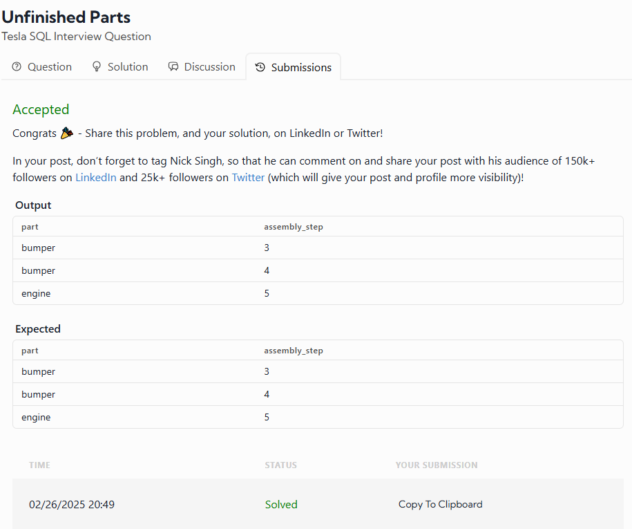

# Tesla Production Bottleneck Analysis

## Problem Statement
Tesla is investigating production bottlenecks and needs your help to extract the relevant data. Write a query to determine which parts have begun the assembly process but are not yet finished.

## Assumptions
- The `parts_assembly` table contains all parts currently in production, each at varying stages of the assembly process.
- An **unfinished part** is one that lacks a `finish_date`.
- This question is straightforward, so let's approach it with simplicity in both thinking and solution.
- **Effective April 11th, 2023**, the problem statement and assumptions were updated to enhance clarity.

## Table Schema
### `parts_assembly` Table:
| Column Name    | Type     |
|---------------|----------|
| part         | string   |
| finish_date  | datetime |
| assembly_step | integer  |

## Example Input
### `parts_assembly` Table:
| part    | finish_date        | assembly_step |
|---------|-------------------|--------------|
| battery | 01/22/2022 00:00:00 | 1           |
| battery | 02/22/2022 00:00:00 | 2           |
| battery | 03/22/2022 00:00:00 | 3           |
| bumper  | 01/22/2022 00:00:00 | 1           |
| bumper  | 02/22/2022 00:00:00 | 2           |
| bumper  | NULL                | 3           |
| bumper  | NULL                | 4           |

## Example Output
| part   | assembly_step |
|--------|--------------|
| bumper | 3            |
| bumper | 4            |

## My solution was very simple

SELECT part,assembly_step FROM parts_assembly where finish_date IS NULL;;

### Why I used this, based on my experience the best solutcion is IS NULL.

### The fuction IS NULL is used to get all the rows that are NULLS.

# My Result was:

