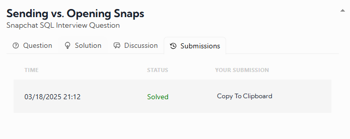

# Sending vs. Opening Snaps

## Snapchat SQL Interview Question

This question is derived from problem #25 in the SQL Chapter of *Ace the Data Science Interview!*

### Problem Statement

Assume you're given tables with information on Snapchat users, including their ages and the time they spent sending and opening snaps.

Write an SQL query to obtain a breakdown of the time spent sending vs. opening snaps as a percentage of the total time spent on these activities, grouped by age group. Round the percentage to two decimal places in the output.

### Calculation Notes:

- Compute the following percentages:
  - `time spent sending / (time spent sending + time spent opening)`
  - `time spent opening / (time spent sending + time spent opening)`
- To avoid integer division in percentages, multiply by `100.0` instead of `100`.
- Effective April 15th, 2023, the solution has been updated and optimized.

### Table Schema

#### `activities` Table:
| Column Name  | Type   |
|-------------|--------|
| activity_id | integer |
| user_id     | integer |
| activity_type | string ('send', 'open', 'chat') |
| time_spent  | float |
| activity_date | datetime |

#### Example Input (`activities` Table):
| activity_id | user_id | activity_type | time_spent | activity_date |
|------------|--------|--------------|------------|--------------|
| 7274       | 123    | open         | 4.50       | 06/22/2022 12:00:00 |
| 2425       | 123    | send         | 3.50       | 06/22/2022 12:00:00 |
| 1413       | 456    | send         | 5.67       | 06/23/2022 12:00:00 |
| 1414       | 789    | chat         | 11.00      | 06/25/2022 12:00:00 |
| 2536       | 456    | open         | 3.00       | 06/25/2022 12:00:00 |

#### `age_breakdown` Table:
| Column Name  | Type |
|-------------|------|
| user_id     | integer |
| age_bucket  | string ('21-25', '26-30', '31-35') |

#### Example Input (`age_breakdown` Table):
| user_id | age_bucket |
|---------|-----------|
| 123     | 31-35     |
| 456     | 26-30     |
| 789     | 21-25     |

### Expected Output
| age_bucket | send_perc | open_perc |
|------------|-----------|-----------|
| 26-30      | 65.40     | 34.60     |
| 31-35      | 43.75     | 56.25     |

### Explanation

For the age group `26-30`, the total time spent sending snaps is `5.67`, and the total time spent opening snaps is `3.00`.

- The percentage of time spent sending snaps is:  
  `5.67 / (5.67 + 3.00) * 100 = 65.40%`
- The percentage of time spent opening snaps is:  
  `3.00 / (5.67 + 3.00) * 100 = 34.60%`

The same calculation is applied to other age groups.

### Solution Implementation
To solve this problem, we use the following SQL query:

```sql
SELECT
    age_bucket,
    ROUND(
        SUM(CASE WHEN activity_type = 'send' THEN time_spent ELSE 0 END) * 100.0 / 
        SUM(time_spent), 
        2
    ) AS send_perc,
    ROUND(
        SUM(CASE WHEN activity_type = 'open' THEN time_spent ELSE 0 END) * 100.0 / 
        SUM(time_spent), 
        2
    ) AS open_perc
FROM activities
JOIN age_breakdown ON activities.user_id = age_breakdown.user_id
WHERE activity_type IN ('send', 'open')
GROUP BY age_bucket
ORDER BY age_bucket;
```

### Query Explanation

1. **`JOIN age_breakdown ON activities.user_id = age_breakdown.user_id`**: This joins the `activities` table with the `age_breakdown` table to get the age bucket of each user.
2. **`WHERE activity_type IN ('send', 'open')`**: Filters only the activities related to sending and opening snaps.
3. **`SUM(CASE WHEN activity_type = 'send' THEN time_spent ELSE 0 END)`**: Sums up the total time spent sending snaps.
4. **`SUM(CASE WHEN activity_type = 'open' THEN time_spent ELSE 0 END)`**: Sums up the total time spent opening snaps.
5. **`SUM(time_spent)`**: Computes the total time spent on both sending and opening snaps.
6. **Calculates percentages**:
   - `send_perc = (total time spent sending / total time spent on sending + opening) * 100`
   - `open_perc = (total time spent opening / total time spent on sending + opening) * 100`
7. **`ROUND(..., 2)`**: Ensures that percentages are rounded to two decimal places.
8. **`GROUP BY age_bucket`**: Groups the results by age bucket.
9. **`ORDER BY age_bucket`**: Orders the results by age group in ascending order.

# My Result was:

