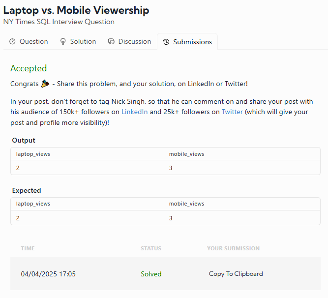

# Laptop vs. Mobile Viewership  
**NY Times SQL Interview Question**

This is the same question as **problem #3** in the SQL Chapter of *Ace the Data Science Interview*!

## 📝 Problem Description

Assume you're given a table on user viewership categorized by device type. The three types of devices are:

- `laptop`
- `tablet`
- `phone`

Your task is to **write a query** that calculates:

- The total viewership for **laptops**
- The total viewership for **mobile devices** (defined as the sum of tablet and phone viewership)

### 🔄 Output Columns

- `laptop_views`: total views from laptops
- `mobile_views`: total views from phones and tablets

> ✅ **Note:** Effective 15 April 2023, the solution has been updated to be more concise and easy to understand.

---

## 📊 Table Schema

**Table Name:** `viewership`

| Column Name | Type                             |
|-------------|----------------------------------|
| user_id     | integer                          |
| device_type | string (`'laptop'`, `'tablet'`, `'phone'`) |
| view_time   | timestamp                        |

---

## 📥 Example Input

| user_id | device_type | view_time           |
|---------|-------------|---------------------|
| 123     | tablet      | 01/02/2022 00:00:00 |
| 125     | laptop      | 01/07/2022 00:00:00 |
| 128     | laptop      | 02/09/2022 00:00:00 |
| 129     | phone       | 02/09/2022 00:00:00 |
| 145     | tablet      | 02/24/2022 00:00:00 |

---

## 📤 Example Output

| laptop_views | mobile_views |
|--------------|--------------|
| 2            | 3            |

### 💡 Explanation

- Laptop views: user_id 125 and 128 → **2 views**
- Mobile views (tablet + phone): user_id 123, 129, and 145 → **3 views**

---

## 💻 SQL Solution

```sql
SELECT
  SUM(CASE WHEN device_type = 'laptop' THEN 1 ELSE 0 END) AS laptop_views,
  SUM(CASE WHEN device_type IN ('tablet', 'phone') THEN 1 ELSE 0 END) AS mobile_views
FROM viewership;


# My Result was:


